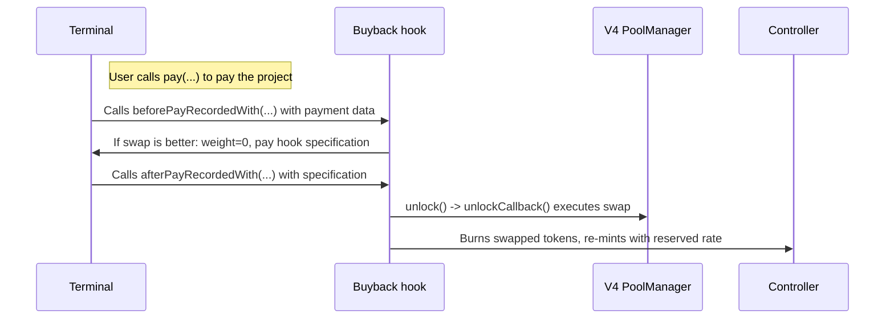

# Juicebox Buyback Hook

A Juicebox data hook and pay hook that automatically routes payments through the better of two paths: minting new project tokens from the terminal, or buying them from a Uniswap V4 pool -- whichever yields more tokens for the beneficiary. The project's reserved rate applies to either route.

_If you're having trouble understanding this contract, take a look at the [core protocol contracts](https://github.com/Bananapus/nana-core-v6) and the [documentation](https://docs.juicebox.money/) first. If you have questions, reach out on [Discord](https://discord.com/invite/ErQYmth4dS)._

## Architecture

| Contract | Description |
|----------|-------------|
| `JBBuybackHook` | Core hook. Implements `IJBRulesetDataHook` (checked before recording payment), `IJBPayHook` (executed after), and `IUnlockCallback` (Uniswap V4 swap settlement). Compares the terminal's mint rate against a Uniswap V4 swap quote and takes the better route. Swapped tokens are burned, then re-minted through the controller to apply the reserved rate uniformly. Stores an immutable `ORACLE_HOOK` -- all pools created via `setPoolFor` or `initializePoolFor` use this oracle hook in their `PoolKey` for TWAP price protection. |
| `JBBuybackHookRegistry` | A proxy data hook that delegates `beforePayRecordedWith` to a per-project or default `JBBuybackHook` instance. The registry owner manages an allowlist of hook implementations. Project owners choose (and can permanently lock) which buyback hook their project uses. |
| `JBSwapLib` | Shared library for oracle queries, slippage tolerance, price impact estimation, and `sqrtPriceLimitX96` calculations. Uses a continuous sigmoid formula for smooth dynamic slippage across all swap sizes. |

## How It Works



1. A payment is made to a project's terminal.
2. The terminal calls `beforePayRecordedWith(context)` on the data hook (this contract).
3. The hook calculates how many tokens the payer would get by minting directly (`weight * amount / weightRatio`).
4. It compares that against a Uniswap V4 quote. The TWAP-based quote uses the pool's oracle hook (if available) or falls back to spot price, then applies sigmoid-based slippage tolerance. The payer/frontend can also supply their own quote in metadata -- the hook uses whichever is higher (more protective).
5. If the swap yields more tokens, the hook returns `weight = 0` and specifies itself as a pay hook with the swap amount.
6. The terminal calls `afterPayRecordedWith(context)` on the pay hook.
7. The hook executes the swap via `POOL_MANAGER.unlock()`, burns the received project tokens, adds any leftover terminal tokens back to the project's balance, and mints the total (swapped + leftover mint) through the controller with `useReservedPercent: true`.

If the swap fails (slippage, insufficient liquidity, etc.), `_swap` catches the revert and returns 0, which causes `afterPayRecordedWith` to revert with `JBBuybackHook_SpecifiedSlippageExceeded`. The terminal then falls back to its default minting behavior.

## Registry

The `JBBuybackHookRegistry` sits between the terminal and individual hook implementations:

- **Owner-managed allowlist**: The registry owner calls `allowHook(hook)` / `disallowHook(hook)` to control which implementations projects can use.
- **Default hook**: The owner calls `setDefaultHook(hook)` to set the fallback for projects that have not explicitly chosen one. Setting a default also adds it to the allowlist.
- **Per-project override**: Project owners call `setHookFor(projectId, hook)` to select an allowed hook. Permission: `SET_BUYBACK_HOOK` (ID 27).
- **Locking**: Project owners call `lockHookFor(projectId)` to permanently freeze their hook choice. Once locked, the hook cannot be changed. Same permission: `SET_BUYBACK_HOOK` (ID 27). Locking requires a non-zero hook (either explicitly set or inherited from default). If the project is using the default, locking snapshots that default into the project's storage.
- **Mint permission delegation**: `hasMintPermissionFor` returns `true` only for the address of the hook active for the project, enabling the hook to mint tokens through the controller.

When `disallowHook` removes a hook that is currently the default, the default is also cleared.

## Install

For projects using `npm` to manage dependencies (recommended):

```bash
npm install @bananapus/buyback-hook-v6
```

For projects using `forge` to manage dependencies:

```bash
forge install Bananapus/nana-buyback-hook-v6
```

If you're using `forge`, add `@bananapus/buyback-hook-v6/=lib/nana-buyback-hook-v6/` to `remappings.txt`.

This package depends on `@bananapus/univ4-router-v6` (for the oracle hook deployment used in the deployment script).

## Develop

`nana-buyback-hook-v6` uses [npm](https://www.npmjs.com/) (version >=20.0.0) for package management and [Foundry](https://github.com/foundry-rs/foundry) for builds and tests.

```bash
npm ci && forge install
```

| Command | Description |
|---------|-------------|
| `forge build` | Compile the contracts and write artifacts to `out`. |
| `forge test` | Run the tests. |
| `forge fmt` | Lint. |
| `forge build --sizes` | Get contract sizes. |
| `forge coverage` | Generate a test coverage report. |
| `forge clean` | Remove the build artifacts and cache directories. |

### Scripts

| Command | Description |
|---------|-------------|
| `npm test` | Run local tests. |
| `npm run test:fork` | Run fork tests (for use in CI). |
| `npm run coverage` | Generate an LCOV test coverage report. |

### Configuration

Key `foundry.toml` settings:

- `solc = '0.8.26'`
- `evm_version = 'cancun'` (required for Uniswap V4's transient storage `TSTORE`/`TLOAD`)
- `optimizer_runs = 100000000`
- `fuzz.runs = 4096`

## Repository Layout

```
nana-buyback-hook-v6/
├── src/
│   ├── JBBuybackHook.sol             # Core buyback hook (data hook + pay hook + V4 unlock callback)
│   ├── JBBuybackHookRegistry.sol     # Per-project hook routing with allowlist and locking
│   ├── libraries/
│   │   └── JBSwapLib.sol             # Oracle queries, slippage tolerance, price limit calculations
│   └── interfaces/
│       ├── IJBBuybackHook.sol        # Buyback hook interface
│       ├── IJBBuybackHookRegistry.sol # Registry interface
│       └── IGeomeanOracle.sol        # V4 oracle hook interface (TWAP observation)
├── script/
│   └── Deploy.s.sol                  # Multi-chain deployment script (Ethereum, Optimism, Base, Arbitrum)
└── test/
    ├── V4BuybackHook.t.sol           # Core hook unit tests
    ├── Registry.t.sol                # Registry unit tests
    ├── JBSwapLib.t.sol               # Library unit tests
    ├── MEVScenarios.t.sol            # MEV attack scenario tests
    ├── fork/
    │   └── V4ForkTest.t.sol          # Mainnet fork integration tests
    └── mock/
        ├── MockOracleHook.sol        # Configurable TWAP oracle mock
        ├── MockPoolManager.sol       # V4 PoolManager mock
        └── MockSplitHook.sol         # Split hook mock
```

## Project Owner Usage Guide

### Setting The Pool

There are two ways to configure the pool:

1. **Simplified**: Call `setPoolFor(projectId, fee, tickSpacing, twapWindow, terminalToken)`. The hook constructs the `PoolKey` automatically using the project token, terminal token, and its immutable `ORACLE_HOOK` as the pool's hooks address. The pool must already be initialized in the V4 PoolManager.
2. **Explicit**: Call `setPoolFor(projectId, poolKey, twapWindow, terminalToken)` with a full `PoolKey` struct.
3. **Atomic initialize + set**: Call `initializePoolFor(projectId, fee, tickSpacing, twapWindow, terminalToken, sqrtPriceX96)` to initialize the pool in the PoolManager (if not already initialized) and configure it in one transaction. Uses `ORACLE_HOOK` in the constructed `PoolKey`.

Pool assignments can only be set once per terminal token -- they are immutable once set to prevent swap routing manipulation.

- The `PoolKey` currencies must match the project token and the terminal token (in either order). The hook validates this on-chain.
- All pools created via the simplified or atomic overloads use the hook's immutable `ORACLE_HOOK` for TWAP price protection.
- If using ETH, pass `JBConstants.NATIVE_TOKEN` (`0x000000000000000000000000000000000000EEEe`) as `terminalToken`. The hook normalizes this to `address(0)` internally, matching Uniswap V4's native ETH representation.
- The project must have already issued an ERC-20 token (via `JBTokens`).
- Permission: `SET_BUYBACK_POOL` (ID 26).

### Setting TWAP Parameters

The TWAP window controls the time period over which the time-weighted average price is computed. A shorter window gives more accurate data but is easier to manipulate; a longer window is more stable but can lag during high volatility.

- Call `setTwapWindowOf(projectId, newWindow)` to change the TWAP window (min: 5 minutes, max: 2 days).
- A 30-minute window is a good starting point for high-activity pairs.
- Permission: `SET_BUYBACK_TWAP` (ID 25).
- The TWAP window is shared across all pools for the same project.

### Oracle Behavior

The hook stores an immutable `ORACLE_HOOK` (an `IHooks` address set at construction). All pools created via the simplified `setPoolFor` or `initializePoolFor` overloads embed this oracle hook in their `PoolKey`. The hook queries the oracle via the `IGeomeanOracle.observe` interface for TWAP data. If the oracle hook reverts or is not available, the hook falls back to the pool's current spot price and in-range liquidity from the PoolManager.

When the oracle returns zero liquidity, the hook returns 0 for the quote, which causes it to fall back to minting rather than swapping -- protecting against swaps in pools with no liquidity.

### Slippage Tolerance

The buyback hook uses a continuous sigmoid formula (`JBSwapLib.getSlippageTolerance`) to dynamically calculate slippage tolerance based on the estimated price impact of the swap:

- Small swaps in deep pools get ~2% tolerance (minimum floor).
- Large swaps relative to pool liquidity approach the 88% ceiling.
- The minimum tolerance is the pool fee + 1% buffer (with an absolute floor of 2%).
- If the calculated slippage tolerance hits the 88% maximum, the hook returns 0 (triggers mint fallback) rather than attempting a swap with extreme slippage.

### Avoiding MEV

The hook provides two layers of MEV protection:

1. **sqrtPriceLimitX96**: The V4 swap is executed with a price limit computed from the minimum acceptable output (`JBSwapLib.sqrtPriceLimitFromAmounts`). This stops the swap early if the price moves unfavorably, rather than executing at a bad rate.
2. **Quote floor**: The hook always takes the higher of the payer's quote and the TWAP-based quote. A stale or manipulated payer quote cannot produce a worse deal than what the oracle suggests.

Payers/frontends should provide a reasonable minimum quote in metadata for additional protection. You can also use the [Flashbots Protect RPC](https://protect.flashbots.net/) for transactions that trigger the buyback hook.

## Payment Metadata

The hook reads metadata with key `"quote"` (resolved via `JBMetadataResolver`), encoding `(uint256 amountToSwapWith, uint256 minimumSwapAmountOut)`:

- If `amountToSwapWith == 0`, the full payment amount is used for the swap.
- If `amountToSwapWith > 0`, only that portion is swapped and the remainder is minted directly.
- If `amountToSwapWith > totalPaid`, the transaction reverts with `JBBuybackHook_InsufficientPayAmount`.
- The `minimumSwapAmountOut` is compared against the TWAP-derived minimum -- the higher value is used.

## Supported Chains

The deployment script (`Deploy.s.sol`) supports:

| Chain | PoolManager |
|-------|-------------|
| Ethereum Mainnet | `0x000000000004444c5dc75cB358380D2e3dE08A90` |
| Optimism | `0x9a13f98cb987694c9f086b1f5eb990eea8264ec3` |
| Base | `0x498581ff718922c3f8e6a244956af099b2652b2b` |
| Arbitrum | `0x360e68faccca8ca495c1b759fd9eee466db9fb32` |

Sepolia testnets for all four chains are also supported.

## Risks

- The hook depends on liquidity in a Uniswap V4 pool. If liquidity migrates to a new pool with different `PoolKey` parameters (different fee, tickSpacing, or hooks), the hook cannot be redirected -- pool assignments are immutable once set via `setPoolFor`.
- `setPoolFor` can only be called once per project + terminal token pair. If you need to use a different pool, a new hook deployment is needed.
- If the TWAP window isn't set appropriately, payers may receive fewer tokens than expected.
- Low liquidity pools are vulnerable to TWAP manipulation by attackers.
- If the pool's oracle hook is absent or reverts, the hook falls back to spot price, which is more susceptible to manipulation.
- The `ORACLE_HOOK` immutable is set at construction and cannot be changed. If the oracle hook implementation has a bug or is deprecated, a new `JBBuybackHook` deployment is required.
- The registry's `lockHookFor` is irreversible. Once locked, the project cannot change its hook implementation even if a security issue is found in that implementation.
