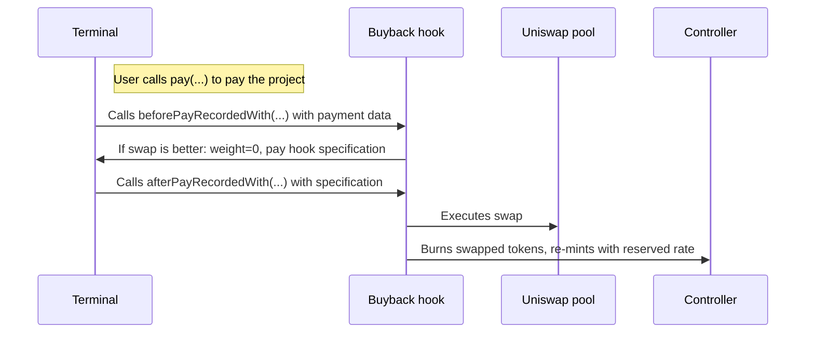

# nana-buyback-hook-v5

A Juicebox data hook and pay hook that automatically routes payments through the better of two paths: minting new project tokens from the terminal, or buying them from a Uniswap V3 pool -- whichever yields more tokens for the beneficiary. The project's reserved rate applies to either route.

_If you're having trouble understanding this contract, take a look at the [core protocol contracts](https://github.com/Bananapus/nana-core) and the [documentation](https://docs.juicebox.money/) first. If you have questions, reach out on [Discord](https://discord.com/invite/ErQYmth4dS)._

## Architecture

| Contract | Description |
|----------|-------------|
| `JBBuybackHook` | Core hook. Implements `IJBRulesetDataHook` (checked before recording payment) and `IJBPayHook` (executed after). Compares the terminal's mint rate against a Uniswap V3 swap quote and takes the better route. Swapped tokens are burned, then re-minted through the controller to apply the reserved rate uniformly. |
| `JBBuybackHookRegistry` | A proxy data hook that delegates `beforePayRecordedWith` to a per-project or default `JBBuybackHook` instance. Allows project owners to choose (and lock) which buyback hook implementation they use. |
| `JBSwapLib` | Shared library for slippage tolerance and price limit calculations. Uses a continuous sigmoid formula for smooth dynamic slippage across all swap sizes. |

## How It Works



1. A payment is made to a project's terminal.
2. The terminal calls `beforePayRecordedWith(context)` on the data hook (this contract).
3. The hook calculates how many tokens the payer would get by minting directly (`weight * amount / weightRatio`).
4. It compares that against a Uniswap V3 quote (user-provided or TWAP-derived with sigmoid slippage tolerance).
5. If the swap yields more tokens, the hook returns `weight = 0` and specifies itself as a pay hook with the swap amount.
6. The terminal calls `afterPayRecordedWith(context)` on the pay hook.
7. The hook executes the swap, burns the received project tokens, adds any leftover terminal tokens back to the project's balance, and mints the total (swapped + leftover mint) through the controller with `useReservedPercent: true`.

If the swap fails (slippage, insufficient liquidity, etc.), the hook reverts, and the terminal's default minting behavior takes over.

## Install

For projects using `npm` to manage dependencies (recommended):

```bash
npm install @bananapus/buyback-hook
```

For projects using `forge` to manage dependencies:

```bash
forge install Bananapus/nana-buyback-hook
```

If you're using `forge`, add `@bananapus/buyback-hook/=lib/nana-buyback-hook/` to `remappings.txt`.

## Develop

`nana-buyback-hook` uses [npm](https://www.npmjs.com/) (version >=20.0.0) for package management and [Foundry](https://github.com/foundry-rs/foundry) for builds and tests.

```bash
npm ci && forge install
```

| Command | Description |
|---------|-------------|
| `forge build` | Compile the contracts and write artifacts to `out`. |
| `forge test` | Run the tests. |
| `forge fmt` | Lint. |
| `forge build --sizes` | Get contract sizes. |
| `forge coverage` | Generate a test coverage report. |
| `forge clean` | Remove the build artifacts and cache directories. |

### Scripts

| Command | Description |
|---------|-------------|
| `npm test` | Run local tests. |
| `npm run test:fork` | Run fork tests (for use in CI). |
| `npm run coverage` | Generate an LCOV test coverage report. |

### Configuration

Key `foundry.toml` settings:

- `solc = '0.8.23'`
- `evm_version = 'paris'` (L2-compatible)
- `optimizer_runs = 100000000`
- `fuzz.runs = 16384`

## Repository Layout

```
nana-buyback-hook-v5/
├── src/
│   ├── JBBuybackHook.sol             # Core buyback hook (data hook + pay hook)
│   ├── JBBuybackHookRegistry.sol     # Per-project hook routing
│   ├── libraries/
│   │   └── JBSwapLib.sol             # Slippage tolerance + price limit calculations
│   └── interfaces/
│       ├── IJBBuybackHook.sol        # Buyback hook interface
│       ├── IJBBuybackHookRegistry.sol # Registry interface
│       └── external/
│           └── IWETH9.sol            # WETH wrapper interface
├── script/
│   └── Deploy.s.sol                  # Deployment script
└── test/
    ├── Fork.t.sol                    # Fork tests
    └── helpers/                      # Test helpers
```

## Project Owner Usage Guide

### Setting The Pool

Call `setPoolFor(projectId, fee, twapWindow, terminalToken)` to configure the Uniswap V3 pool for your project. This can only be called once per terminal token.

- The `fee` is a `uint24` with the same representation as Uniswap (basis points with 2 decimals): 0.01% = `100`, 0.05% = `500`, 0.3% = `3000`, 1% = `10000`.
- If using ETH, pass `JBConstants.NATIVE_TOKEN` (`0x000000000000000000000000000000000000EEEe`) as `terminalToken`.
- The pool address is computed via create2 using Uniswap V3's canonical init code hash.

### Setting TWAP Parameters

The TWAP window controls the time period over which the time-weighted average price is computed. A shorter window gives more accurate data but is easier to manipulate; a longer window is more stable but can lag during high volatility.

- Call `setTwapWindowOf(projectId, newWindow)` to change the TWAP window (min: 2 minutes, max: 2 days).
- A 30-minute window is a good starting point for high-activity pairs.

### Slippage Tolerance

The buyback hook uses a continuous sigmoid formula (`JBSwapLib.getSlippageTolerance`) to dynamically calculate slippage tolerance based on the estimated price impact of the swap:

- Small swaps in deep pools get ~2% tolerance.
- Large swaps relative to pool liquidity approach the 88% ceiling.
- The minimum tolerance is the pool fee + 1% (floor of 2%).

### Avoiding MEV

Payers/frontends should provide a reasonable minimum quote in metadata to protect against MEV. You can also use the [Flashbots Protect RPC](https://protect.flashbots.net/) for transactions that trigger the buyback hook.

## Payment Metadata

The hook reads metadata with key `"quote"`, encoding `(uint256 amountToSwapWith, uint256 minimumSwapAmountOut)`:

- If `amountToSwapWith == 0`, the full payment amount is used for the swap.
- If `minimumSwapAmountOut == 0`, a TWAP-based quote is calculated with sigmoid slippage tolerance.

## Risks

- The hook depends on liquidity in a Uniswap V3 pool. If liquidity migrates to a new pool, the project owner must call `setPoolFor(...)`. If liquidity migrates to a different exchange or Uniswap version, a new hook deployment is needed.
- `setPoolFor` can only be called once per project + terminal token pair. Once set, the pool cannot be changed.
- If the TWAP window isn't set appropriately, payers may receive fewer tokens than expected.
- Low liquidity pools are vulnerable to TWAP manipulation by attackers.
